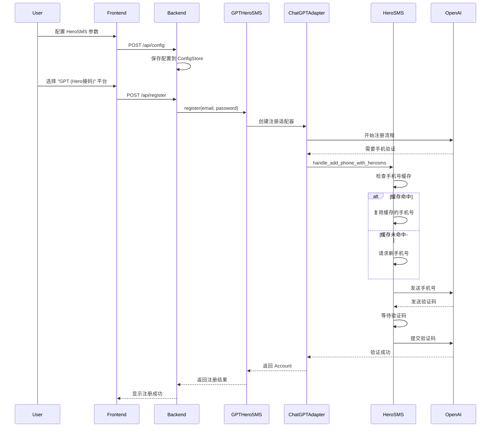

# Design Document: GPT Hero SMS Platform

## Overview

本设计文档描述了在 any-auto-register 项目中集成 HeroSMS 接码平台作为新平台插件的技术方案。该功能将允许用户通过 HeroSMS 虚拟手机号码完成 ChatGPT 账号注册，并在前端界面中作为独立平台选项 "GPT (Hero接码)" 显示。

### 设计目标

1. **代码复用**: 最大化复用现有 ChatGPT 平台的注册逻辑和 gpt-sms 项目的 HeroSMS 客户端
2. **配置灵活**: 支持用户在前端界面配置 HeroSMS 参数（API Key、服务代码、国家 ID、最高单价）
3. **手机号复用**: 实现 20 分钟内手机号码缓存复用机制，降低接码成本
4. **错误处理**: 提供完善的错误处理和重试策略，提高注册成功率
5. **日志记录**: 记录详细的注册流程日志，便于调试和监控

### 核心特性

- 基于 BasePlatform 的插件架构，自动注册到平台注册表
- 集成 gpt-sms 项目的 HeroSMSClient 和 handle_add_phone_with_herosms 函数
- 复用 ChatGPT 平台的注册适配器（RefreshTokenRegistrationEngine / AccessTokenOnlyRegistrationEngine）
- 支持手机号码 20 分钟缓存复用，跨进程持久化
- 前端配置界面支持 HeroSMS 参数配置
- 支持代理访问 HeroSMS 和 OpenAI API

## Architecture

### 系统架构图

```mermaid
graph TB
    subgraph "Frontend"
        A[Settings Page] --> B[Platform Selection]
        A --> C[HeroSMS Config Section]
    end
    
    subgraph "Backend API"
        D[/api/platforms] --> E[Registry.list_platforms]
        F[/api/config] --> G[ConfigStore]
        H[/api/register] --> I[TaskManager]
    end
    
    subgraph "Core Layer"
        E --> J[Platform Registry]
        J --> K[GPTHeroSMSPlatform]
        I --> K
    end
    
    subgraph "GPTHeroSMSPlatform"
        K --> L[register method]
        K --> M[check_valid method]
        L --> N[ChatGPT Registration Adapter]
        L --> O[HeroSMS Integration]
    end
    
    subgraph "ChatGPT Integration"
        N --> P[RefreshTokenRegistrationEngine]
        N --> Q[AccessTokenOnlyRegistrationEngine]
        P --> R[handle_add_phone callback]
        Q --> R
    end
    
    subgraph "HeroSMS Integration"
        O --> S[HeroSMSClient]
        R --> T[handle_add_phone_with_herosms]
        T --> S
        T --> U[Phone Cache Manager]
    end
    
    subgraph "External Services"
        S --> V[HeroSMS API]
        P --> W[OpenAI Auth API]
        Q --> W
    end
    
    style K fill:#e1f5ff
    style N fill:#fff4e1
    style O fill:#ffe1e1
```

### 数据流图



## Components and Interfaces

### 1. GPTHeroSMSPlatform 类

**文件路径**: `platforms/gpt_hero_sms/plugin.py`

**职责**: 
- 实现 BasePlatform 接口
- 集成 HeroSMS 客户端
- 复用 ChatGPT 注册适配器
- 处理手机验证流程

**接口定义**:

```python
@register
class GPTHeroSMSPlatform(BasePlatform):
    name = "gpt_hero_sms"
    display_name = "GPT (Hero接码)"
    version = "1.0.0"
    supported_executors = ["protocol", "headless", "headed"]
    
    def __init__(self, config: RegisterConfig = None):
        """初始化平台插件，读取 HeroSMS 配置"""
        
    def register(self, email: str = None, password: str = None) -> Account:
        """执行注册流程，集成 HeroSMS 手机验证"""
        
    def check_valid(self, account: Account) -> bool:
        """检查账号有效性"""
        
    def get_platform_actions(self) -> list:
        """返回平台支持的操作列表"""
        
    def execute_action(self, action_id: str, account: Account, params: dict) -> dict:
        """执行平台特定操作"""
```

**关键方法实现**:

```python
def register(self, email: str = None, password: str = None) -> Account:
    # 1. 生成随机密码（如果未提供）
    if not password:
        password = generate_random_password()
    
    # 2. 读取 HeroSMS 配置
    extra_config = self.config.extra or {}
    herosms_api_key = extra_config.get("herosms_api_key", "")
    herosms_service = extra_config.get("herosms_service", "dr")
    herosms_country = int(extra_config.get("herosms_country", 187))
    herosms_max_price = float(extra_config.get("herosms_max_price", -1))
    
    if not herosms_api_key:
        raise RuntimeError("HeroSMS API Key 未配置")
    
    # 3. 创建 HeroSMS 客户端
    herosms_client = HeroSMSClient(
        api_key=herosms_api_key,
        proxy=self.config.proxy
    )
    
    # 4. 创建 ChatGPT 注册适配器
    adapter = build_chatgpt_registration_mode_adapter(extra_config)
    
    # 5. 创建邮箱服务（复用 ChatGPT 平台逻辑）
    email_service = self._create_email_service(email)
    
    # 6. 创建注册上下文
    context = ChatGPTRegistrationContext(
        email_service=email_service,
        proxy_url=self.config.proxy,
        callback_logger=self._log_fn,
        email=email,
        password=password,
        browser_mode=self.config.executor_type,
        max_retries=int(extra_config.get("register_max_retries", 3)),
        extra_config=extra_config,
    )
    
    # 7. 注入 HeroSMS 手机验证回调
    self._inject_herosms_callback(context, herosms_client, extra_config)
    
    # 8. 执行注册
    result = adapter.run(context)
    
    if not result or not result.success:
        raise RuntimeError(result.error_message if result else "注册失败")
    
    # 9. 构建 Account 对象
    return Account(
        platform="gpt_hero_sms",
        email=result.email,
        password=password,
        user_id=result.account_id,
        token=result.access_token,
        status=AccountStatus.REGISTERED,
        extra={
            "access_token": result.access_token,
            "refresh_token": result.refresh_token,
            "id_token": result.id_token,
            "session_token": result.session_token,
            "herosms_used": True,
        }
    )
```

### 2. HeroSMS 集成模块

**文件路径**: `platforms/gpt_hero_sms/herosms_integration.py`

**职责**:
- 封装 HeroSMS 客户端调用
- 实现手机验证回调函数
- 处理手机号码缓存逻辑

**接口定义**:

```python
def create_herosms_phone_callback(
    herosms_client: HeroSMSClient,
    service: str,
    country: int,
    max_price: float,
    proxy: str = None,
    log_fn: Callable = None
) -> Callable:
    """
    创建 HeroSMS 手机验证回调函数
    
    Args:
        herosms_client: HeroSMS 客户端实例
        service: 服务代码（如 "dr" for OpenAI）
        country: 国家 ID（如 187 for USA）
        max_price: 最高单价（-1 表示不限制）
        proxy: 代理地址
        log_fn: 日志回调函数
    
    Returns:
        回调函数，接受 (session, auth_url, device_id) 参数
    """
    
def inject_herosms_to_registration_engine(
    engine,
    herosms_callback: Callable
) -> None:
    """
    将 HeroSMS 回调注入到注册引擎中
    
    Args:
        engine: ChatGPT 注册引擎实例
        herosms_callback: HeroSMS 手机验证回调函数
    """
```

**实现示例**:

```python
def create_herosms_phone_callback(
    herosms_client: HeroSMSClient,
    service: str,
    country: int,
    max_price: float,
    proxy: str = None,
    log_fn: Callable = None
) -> Callable:
    def phone_callback(session, auth_url, device_id, **kwargs):
        """手机验证回调函数"""
        if log_fn:
            log_fn("[HeroSMS] 开始手机验证流程")
        
        # 调用 gpt-sms 项目的 handle_add_phone_with_herosms
        # 注意：需要适配参数格式
        success = handle_add_phone_with_herosms(
            session=session,
            auth_url=auth_url,
            device_id=device_id,
            proxy=proxy,
            ua=kwargs.get("ua"),
            impersonate=kwargs.get("impersonate")
        )
        
        if success:
            if log_fn:
                log_fn("[HeroSMS] 手机验证成功")
        else:
            if log_fn:
                log_fn("[HeroSMS] 手机验证失败")
            raise RuntimeError("HeroSMS 手机验证失败")
        
        return success
    
    return phone_callback
```

### 3. 前端配置组件

**文件路径**: `frontend/src/pages/Settings.tsx`

**职责**:
- 提供 HeroSMS 配置界面
- 保存配置到后端
- 显示配置状态

**配置字段**:

```typescript
interface HeroSMSConfig {
  herosms_api_key: string;      // HeroSMS API Key（必填）
  herosms_service: string;       // 服务代码（默认 "dr"）
  herosms_country: number;       // 国家 ID（默认 187）
  herosms_max_price: number;     // 最高单价（默认 -1）
}
```

**UI 设计**:

在 Settings 页面的 TAB_ITEMS 中添加新的配置节：

```typescript
{
  key: 'herosms',
  label: 'HeroSMS 接码',
  icon: <PhoneOutlined />,
  sections: [
    {
      title: 'HeroSMS 接码配置',
      desc: '配置 HeroSMS 接码平台参数，用于 GPT (Hero接码) 平台注册',
      fields: [
        { 
          key: 'herosms_api_key', 
          label: 'HeroSMS API Key', 
          placeholder: '请输入 API Key',
          secret: true,
          required: true
        },
        { 
          key: 'herosms_service', 
          label: '服务代码', 
          placeholder: 'dr',
          tooltip: 'OpenAI 服务代码为 dr'
        },
        { 
          key: 'herosms_country', 
          label: '国家 ID', 
          placeholder: '187',
          tooltip: '美国为 187，可通过 API 查询其他国家'
        },
        { 
          key: 'herosms_max_price', 
          label: '最高单价', 
          placeholder: '-1',
          tooltip: '-1 表示不限制价格'
        },
      ],
    },
  ],
}
```

### 4. 配置存储

**后端配置管理**:

配置通过 `config_store` 模块持久化，与其他平台配置统一管理。

**配置键名**:
- `herosms_api_key`: HeroSMS API Key
- `herosms_service`: 服务代码
- `herosms_country`: 国家 ID
- `herosms_max_price`: 最高单价

**配置读取**:

```python
def _read_herosms_config(self) -> dict:
    """从 RegisterConfig.extra 读取 HeroSMS 配置"""
    extra = self.config.extra or {}
    return {
        "api_key": extra.get("herosms_api_key", ""),
        "service": extra.get("herosms_service", "dr"),
        "country": int(extra.get("herosms_country", 187)),
        "max_price": float(extra.get("herosms_max_price", -1)),
    }
```

## Data Models

### Account 数据模型

GPT Hero SMS 平台的 Account 对象结构：

```python
@dataclass
class Account:
    platform: str = "gpt_hero_sms"
    email: str                          # 注册邮箱
    password: str                       # 账号密码
    user_id: str                        # OpenAI 用户 ID
    token: str                          # Access Token
    status: AccountStatus = AccountStatus.REGISTERED
    extra: dict = {
        "access_token": str,            # OpenAI Access Token
        "refresh_token": str,           # OpenAI Refresh Token（可选）
        "id_token": str,                # OpenAI ID Token
        "session_token": str,           # Session Token（可选）
        "herosms_used": bool,           # 标记使用了 HeroSMS
        "herosms_phone": str,           # 使用的手机号（可选）
        "herosms_activation_id": str,   # HeroSMS 激活 ID（可选）
    }
```

### RegisterConfig 数据模型

注册配置对象扩展：

```python
@dataclass
class RegisterConfig:
    executor_type: str = "protocol"
    captcha_solver: str = "yescaptcha"
    proxy: Optional[str] = None
    extra: dict = {
        # HeroSMS 配置
        "herosms_api_key": str,
        "herosms_service": str,
        "herosms_country": int,
        "herosms_max_price": float,
        
        # ChatGPT 配置
        "chatgpt_registration_mode": str,
        "register_max_retries": int,
        "mailbox_otp_timeout_seconds": int,
        ...
    }
```

### 手机号缓存数据模型

手机号缓存结构（内存 + 磁盘持久化）：

```python
phone_cache = {
    "phone_number": str,        # 手机号（带国家代码，如 +1234567890）
    "activation_id": str,       # HeroSMS 激活 ID
    "acquired_at": float,       # 获取时间戳（Unix timestamp）
    "use_count": int,           # 使用次数
    "used_codes": set[str],     # 已使用的验证码集合
    "client": HeroSMSClient,    # HeroSMS 客户端实例
}
```

**缓存生命周期**: 20 分钟（1200 秒）

**持久化文件**: `data/.herosms_phone_cache.json`

**缓存策略**:
1. 首次注册时请求新手机号，缓存 20 分钟
2. 20 分钟内的后续注册复用缓存的手机号
3. 每次使用后记录已用验证码，避免重复使用
4. 缓存过期后自动失效，下次注册请求新号码
5. 跨进程共享缓存（通过磁盘持久化）

## Error Handling

### 错误分类

1. **配置错误**
   - HeroSMS API Key 未配置
   - 配置参数格式错误

2. **HeroSMS API 错误**
   - 余额不足
   - 请求手机号失败
   - 等待验证码超时
   - 手机号被 OpenAI 拒绝

3. **OpenAI API 错误**
   - 手机号已达使用上限
   - 验证码错误
   - 网络请求失败

4. **注册流程错误**
   - 邮箱验证失败
   - 密码不符合要求
   - 注册被拒绝

### 错误处理策略

```python
class GPTHeroSMSError(Exception):
    """GPT Hero SMS 平台错误基类"""
    pass

class HeroSMSConfigError(GPTHeroSMSError):
    """HeroSMS 配置错误"""
    pass

class HeroSMSAPIError(GPTHeroSMSError):
    """HeroSMS API 错误"""
    pass

class PhoneVerificationError(GPTHeroSMSError):
    """手机验证错误"""
    pass
```

**错误处理流程**:

```python
def register(self, email: str = None, password: str = None) -> Account:
    try:
        # 1. 验证配置
        config = self._validate_herosms_config()
        
        # 2. 执行注册
        result = self._execute_registration(email, password, config)
        
        return result
        
    except HeroSMSConfigError as e:
        self._log_fn(f"[配置错误] {str(e)}")
        raise RuntimeError(f"HeroSMS 配置错误: {str(e)}")
        
    except HeroSMSAPIError as e:
        self._log_fn(f"[HeroSMS API 错误] {str(e)}")
        raise RuntimeError(f"HeroSMS API 错误: {str(e)}")
        
    except PhoneVerificationError as e:
        self._log_fn(f"[手机验证错误] {str(e)}")
        # 手机号被拒绝时，清除缓存并重试
        if "phone limit" in str(e).lower():
            self._invalidate_phone_cache()
            raise RuntimeError("手机号已达使用上限，请稍后重试")
        raise RuntimeError(f"手机验证失败: {str(e)}")
        
    except Exception as e:
        self._log_fn(f"[未知错误] {str(e)}")
        raise RuntimeError(f"注册失败: {str(e)}")
```

### 重试策略

1. **手机号请求重试**
   - 手机号被 OpenAI 拒绝时，自动请求新号码重试（最多 2 次）
   - 清除缓存，避免重复使用被拒绝的号码

2. **验证码提交重试**
   - 5xx 服务器错误时，重试 3 次，每次间隔递增（5s, 10s, 15s）
   - 4xx 客户端错误时，不重试，直接失败

3. **验证码等待策略**
   - 每 3 秒轮询一次 HeroSMS API
   - 每 30 秒请求 HeroSMS 重新发送验证码
   - 90 秒时触发 OpenAI 重新发送验证码
   - 超时时间根据手机号缓存剩余时间动态调整（最少 60 秒）

4. **注册流程重试**
   - 支持配置最大重试次数（默认 3 次）
   - 每次重试前清理状态，避免状态污染

## Testing Strategy

### PBT 适用性评估

本功能**不适合 Property-Based Testing (PBT)**，原因如下：

1. **外部服务依赖**: 功能依赖 HeroSMS API 和 OpenAI API，这些是外部服务，行为不受我们控制
2. **副作用操作**: 注册账号、发送验证码、接收短信等都是副作用操作，无法通过纯函数测试
3. **配置管理**: 配置读取和验证更适合使用 schema validation 和 example-based tests
4. **UI 渲染**: 前端配置界面应使用 snapshot tests 或 visual regression tests
5. **集成性质**: 这是一个集成功能，主要测试点在于各组件的正确集成，而非算法正确性

因此，本功能采用**单元测试 + 集成测试 + 手动测试**的策略。

### 单元测试

**测试框架**: pytest

**测试范围**:
1. GPTHeroSMSPlatform 类方法
2. HeroSMS 集成模块
3. 配置读取和验证
4. 错误处理逻辑

**测试用例**:

```python
# tests/test_gpt_hero_sms_platform.py

import pytest
from unittest.mock import Mock, patch, MagicMock
from core.base_platform import RegisterConfig, Account, AccountStatus
from platforms.gpt_hero_sms.plugin import GPTHeroSMSPlatform

class TestGPTHeroSMSPlatform:
    """GPTHeroSMSPlatform 单元测试"""
    
    def test_init_with_valid_config(self):
        """测试使用有效配置初始化"""
        config = RegisterConfig(
            executor_type="protocol",
            extra={
                "herosms_api_key": "test_key_123",
                "herosms_service": "dr",
                "herosms_country": 187,
                "herosms_max_price": 10.0,
            }
        )
        platform = GPTHeroSMSPlatform(config)
        assert platform.name == "gpt_hero_sms"
        assert platform.display_name == "GPT (Hero接码)"
        assert platform.version == "1.0.0"
        
    def test_init_without_api_key_raises_error(self):
        """测试缺少 API Key 时在 register 时抛出错误"""
        config = RegisterConfig(extra={})
        platform = GPTHeroSMSPlatform(config)
        with pytest.raises(RuntimeError, match="HeroSMS API Key 未配置"):
            platform.register("test@example.com", "password123")
    
    def test_config_validation(self):
        """测试配置验证逻辑"""
        config = RegisterConfig(
            extra={
                "herosms_api_key": "test_key",
                "herosms_service": "dr",
                "herosms_country": "invalid",  # 应该是 int
                "herosms_max_price": "abc",    # 应该是 float
            }
        )
        platform = GPTHeroSMSPlatform(config)
        # 应该在读取配置时处理类型转换或抛出错误
        
    @patch('platforms.gpt_hero_sms.plugin.HeroSMSClient')
    @patch('platforms.gpt_hero_sms.plugin.build_chatgpt_registration_mode_adapter')
    def test_register_success(self, mock_adapter, mock_client):
        """测试注册成功流程"""
        # Mock HeroSMS 客户端
        mock_client_instance = Mock()
        mock_client.return_value = mock_client_instance
        
        # Mock ChatGPT 注册适配器
        mock_adapter_instance = Mock()
        mock_result = Mock()
        mock_result.success = True
        mock_result.email = "test@example.com"
        mock_result.account_id = "user_123"
        mock_result.access_token = "at_123"
        mock_result.refresh_token = "rt_123"
        mock_result.id_token = "id_123"
        mock_result.session_token = "st_123"
        mock_adapter_instance.run.return_value = mock_result
        mock_adapter.return_value = mock_adapter_instance
        
        config = RegisterConfig(
            extra={
                "herosms_api_key": "test_key",
                "herosms_service": "dr",
                "herosms_country": 187,
            }
        )
        platform = GPTHeroSMSPlatform(config)
        account = platform.register("test@example.com", "password123")
        
        assert account.platform == "gpt_hero_sms"
        assert account.email == "test@example.com"
        assert account.token == "at_123"
        assert account.extra["herosms_used"] is True
        
    def test_check_valid_with_token(self):
        """测试有效 Token 的账号检查"""
        platform = GPTHeroSMSPlatform()
        account = Account(
            platform="gpt_hero_sms",
            email="test@example.com",
            password="password123",
            token="at_123",
            extra={"access_token": "at_123"}
        )
        assert platform.check_valid(account) is True
        
    def test_check_valid_without_token(self):
        """测试无效 Token 的账号检查"""
        platform = GPTHeroSMSPlatform()
        account = Account(
            platform="gpt_hero_sms",
            email="test@example.com",
            password="password123",
            token="",
            extra={}
        )
        assert platform.check_valid(account) is False
        
    def test_get_platform_actions(self):
        """测试平台操作列表"""
        platform = GPTHeroSMSPlatform()
        actions = platform.get_platform_actions()
        assert isinstance(actions, list)
        action_ids = [a["id"] for a in actions]
        assert "refresh_token" in action_ids
        assert "probe_local_status" in action_ids


class TestHeroSMSIntegration:
    """HeroSMS 集成模块单元测试"""
    
    @patch('platforms.gpt_hero_sms.herosms_integration.handle_add_phone_with_herosms')
    def test_phone_callback_success(self, mock_handle):
        """测试手机验证回调成功"""
        mock_handle.return_value = True
        
        from platforms.gpt_hero_sms.herosms_integration import create_herosms_phone_callback
        
        mock_client = Mock()
        callback = create_herosms_phone_callback(
            herosms_client=mock_client,
            service="dr",
            country=187,
            max_price=-1
        )
        
        mock_session = Mock()
        result = callback(mock_session, "https://auth.openai.com", "device_123")
        
        assert result is True
        mock_handle.assert_called_once()
        
    @patch('platforms.gpt_hero_sms.herosms_integration.handle_add_phone_with_herosms')
    def test_phone_callback_failure(self, mock_handle):
        """测试手机验证回调失败"""
        mock_handle.return_value = False
        
        from platforms.gpt_hero_sms.herosms_integration import create_herosms_phone_callback
        
        mock_client = Mock()
        callback = create_herosms_phone_callback(
            herosms_client=mock_client,
            service="dr",
            country=187,
            max_price=-1
        )
        
        mock_session = Mock()
        with pytest.raises(RuntimeError, match="HeroSMS 手机验证失败"):
            callback(mock_session, "https://auth.openai.com", "device_123")


class TestErrorHandling:
    """错误处理单元测试"""
    
    def test_config_error_handling(self):
        """测试配置错误处理"""
        config = RegisterConfig(extra={})
        platform = GPTHeroSMSPlatform(config)
        
        with pytest.raises(RuntimeError, match="HeroSMS API Key 未配置"):
            platform.register("test@example.com")
            
    @patch('platforms.gpt_hero_sms.plugin.HeroSMSClient')
    def test_herosms_api_error_handling(self, mock_client):
        """测试 HeroSMS API 错误处理"""
        mock_client.side_effect = Exception("API Error")
        
        config = RegisterConfig(
            extra={"herosms_api_key": "test_key"}
        )
        platform = GPTHeroSMSPlatform(config)
        
        with pytest.raises(RuntimeError):
            platform.register("test@example.com")
```

### 集成测试

**测试框架**: pytest + pytest-integration

**测试范围**:
1. 完整注册流程（使用 Mock 或测试环境）
2. 手机号缓存复用
3. 前端配置保存和读取
4. 平台注册表自动加载

**测试用例**:

```python
# tests/integration/test_gpt_hero_sms_integration.py

import pytest
import time
from core.registry import get, list_platforms
from platforms.gpt_hero_sms.plugin import GPTHeroSMSPlatform

class TestPlatformRegistry:
    """平台注册表集成测试"""
    
    def test_platform_auto_registration(self):
        """测试平台自动注册到注册表"""
        platforms = list_platforms()
        platform_names = [p["name"] for p in platforms]
        assert "gpt_hero_sms" in platform_names
        
    def test_get_platform_from_registry(self):
        """测试从注册表获取平台"""
        platform_class = get("gpt_hero_sms")
        assert platform_class == GPTHeroSMSPlatform
        assert platform_class.name == "gpt_hero_sms"
        assert platform_class.display_name == "GPT (Hero接码)"


class TestPhoneCacheIntegration:
    """手机号缓存集成测试"""
    
    @pytest.fixture
    def mock_phone_cache(self):
        """Mock 手机号缓存"""
        import platforms.gpt_hero_sms.herosms_integration as integration
        original_cache = integration._phone_cache
        yield
        integration._phone_cache = original_cache
        
    def test_phone_cache_reuse(self, mock_phone_cache):
        """测试手机号缓存复用"""
        # 模拟首次获取手机号
        # 验证缓存被创建
        # 模拟第二次使用
        # 验证缓存被复用
        pass
        
    def test_phone_cache_expiration(self, mock_phone_cache):
        """测试手机号缓存过期"""
        # 模拟获取手机号
        # 等待缓存过期（或修改时间戳）
        # 验证缓存失效
        # 验证下次使用时请求新号码
        pass
        
    def test_phone_cache_persistence(self, tmp_path, mock_phone_cache):
        """测试手机号缓存持久化"""
        # 设置临时缓存文件路径
        # 创建缓存
        # 验证文件被创建
        # 清除内存缓存
        # 从文件加载缓存
        # 验证缓存内容正确
        pass


class TestFrontendConfigIntegration:
    """前端配置集成测试"""
    
    @pytest.fixture
    def test_client(self):
        """创建测试客户端"""
        from app import create_app
        app = create_app(testing=True)
        with app.test_client() as client:
            yield client
            
    def test_save_herosms_config(self, test_client):
        """测试保存 HeroSMS 配置"""
        config_data = {
            "herosms_api_key": "test_key_123",
            "herosms_service": "dr",
            "herosms_country": 187,
            "herosms_max_price": 10.0,
        }
        response = test_client.post("/api/config", json=config_data)
        assert response.status_code == 200
        
    def test_load_herosms_config(self, test_client):
        """测试加载 HeroSMS 配置"""
        # 先保存配置
        config_data = {
            "herosms_api_key": "test_key_123",
            "herosms_service": "dr",
        }
        test_client.post("/api/config", json=config_data)
        
        # 加载配置
        response = test_client.get("/api/config")
        assert response.status_code == 200
        data = response.get_json()
        assert data["herosms_api_key"] == "test_key_123"
        assert data["herosms_service"] == "dr"
```

### Mock-Based 测试

由于功能依赖外部服务，使用 Mock 进行测试：

```python
# tests/test_with_mocks.py

import pytest
from unittest.mock import Mock, patch, MagicMock

class TestWithMockedServices:
    """使用 Mock 的外部服务测试"""
    
    @patch('platforms.gpt_hero_sms.plugin.HeroSMSClient')
    @patch('platforms.gpt_hero_sms.plugin.handle_add_phone_with_herosms')
    def test_full_registration_with_mocks(self, mock_handle_phone, mock_client):
        """使用 Mock 测试完整注册流程"""
        # Mock HeroSMS 客户端
        mock_client_instance = Mock()
        mock_client_instance.request_number.return_value = {
            "activationId": "123456",
            "phoneNumber": "+1234567890",
            "countryPhoneCode": "1",
        }
        mock_client_instance.wait_for_code.return_value = "123456"
        mock_client.return_value = mock_client_instance
        
        # Mock 手机验证函数
        mock_handle_phone.return_value = True
        
        # 执行注册
        # 验证流程正确
        pass
```

### 手动测试

**测试场景**:
1. **首次注册（无缓存）**
   - 配置 HeroSMS 参数
   - 选择 "GPT (Hero接码)" 平台
   - 执行注册
   - 验证手机号获取和验证流程
   - 检查日志输出

2. **缓存复用注册（20 分钟内）**
   - 在首次注册后立即执行第二次注册
   - 验证使用缓存的手机号
   - 检查日志显示 "复用号码"
   - 验证注册成功

3. **缓存过期后注册**
   - 等待 20 分钟后执行注册
   - 验证请求新手机号
   - 检查日志显示 "获取新号码"

4. **手机号被拒绝后重试**
   - 模拟手机号被 OpenAI 拒绝
   - 验证自动请求新号码重试
   - 检查错误处理和日志

5. **验证码超时处理**
   - 模拟验证码长时间未到达
   - 验证超时错误提示
   - 检查重试逻辑

6. **配置错误提示**
   - 不配置 API Key
   - 验证错误提示清晰
   - 配置错误的参数格式
   - 验证参数验证逻辑

7. **前端界面操作**
   - 打开 Settings 页面
   - 填写 HeroSMS 配置
   - 保存配置
   - 验证配置持久化
   - 刷新页面验证配置保留

**测试检查点**:
- ✅ 日志输出是否完整（包含关键步骤）
- ✅ 错误提示是否清晰（用户可理解）
- ✅ 手机号缓存是否正常工作（复用和过期）
- ✅ 注册成功率（多次测试的成功率）
- ✅ 前端配置是否正确保存（刷新后保留）
- ✅ 代理支持是否正常（如果配置了代理）
- ✅ 平台在列表中正确显示

### 测试数据

**测试配置**:
```json
{
  "herosms_api_key": "test_api_key_for_testing",
  "herosms_service": "dr",
  "herosms_country": 187,
  "herosms_max_price": 10.0
}
```

**测试账号**:
- 邮箱: `test+{timestamp}@example.com`
- 密码: 随机生成 16 位

### 测试覆盖率目标

- **单元测试覆盖率**: ≥ 80%
- **集成测试覆盖率**: ≥ 60%
- **关键路径覆盖**: 100%（注册流程、配置管理、错误处理）

### 持续集成

在 CI/CD 流程中：
1. 运行单元测试（每次提交）
2. 运行集成测试（使用 Mock，每次提交）
3. 手动测试（发布前）
4. 生成测试报告和覆盖率报告

---

## 实现注意事项

### 1. 代码复用

- **ChatGPT 注册逻辑**: 完全复用 `chatgpt_registration_mode_adapter.py` 和注册引擎
- **HeroSMS 客户端**: 直接导入 gpt-sms 项目的 `herosms_client.py`
- **手机验证函数**: 复用 `handle_add_phone_with_herosms` 函数

### 2. 配置管理

- HeroSMS 配置存储在 `RegisterConfig.extra` 中
- 前端配置通过 `/api/config` 接口保存
- 配置验证在平台初始化时进行

### 3. 手机号缓存

- 缓存文件路径: `data/.herosms_phone_cache.json`
- 缓存生命周期: 20 分钟
- 跨进程共享: 通过磁盘持久化实现
- 线程安全: 使用 `threading.Lock` 保护缓存操作

### 4. 日志记录

- 使用 `_log_fn` 回调记录日志
- 关键步骤: 手机号获取、验证码接收、验证成功/失败
- 错误信息: 包含详细的错误原因和上下文

### 5. 代理支持

- HeroSMS 客户端支持 HTTP/HTTPS/SOCKS5 代理
- ChatGPT 注册引擎支持代理
- 代理配置从 `RegisterConfig.proxy` 读取

### 6. 前端集成

- 在 Settings 页面添加 HeroSMS 配置节
- 在平台选择下拉框中显示 "GPT (Hero接码)"
- 配置字段使用密码输入框隐藏 API Key

### 7. 错误处理

- 配置错误: 在初始化时抛出
- API 错误: 记录日志并抛出 RuntimeError
- 手机号被拒绝: 清除缓存并重试
- 验证码超时: 根据缓存剩余时间动态调整超时

### 8. 性能优化

- 手机号缓存减少 API 调用
- 验证码轮询间隔 3 秒（避免频繁请求）
- 跨进程缓存共享（提高缓存利用率）

---

## 部署和维护

### 部署步骤

1. 将 `platforms/gpt_hero_sms/` 目录添加到项目
2. 确保 gpt-sms 项目的 `herosms_client.py` 可导入
3. 更新前端 Settings 页面配置
4. 重启后端服务，自动加载新平台插件
5. 在前端配置 HeroSMS 参数

### 监控指标

- 注册成功率
- 手机号缓存命中率
- HeroSMS API 调用次数
- 验证码等待时间
- 错误类型分布

### 维护建议

- 定期检查 HeroSMS API 余额
- 监控手机号被拒绝的频率
- 优化验证码等待超时时间
- 根据使用情况调整缓存生命周期
- 更新 HeroSMS 服务代码和国家列表

---

本设计文档提供了 GPT Hero SMS 平台集成的完整技术方案，涵盖架构设计、组件接口、数据模型、错误处理和测试策略。实现时应严格遵循本设计，确保代码质量和系统稳定性。
