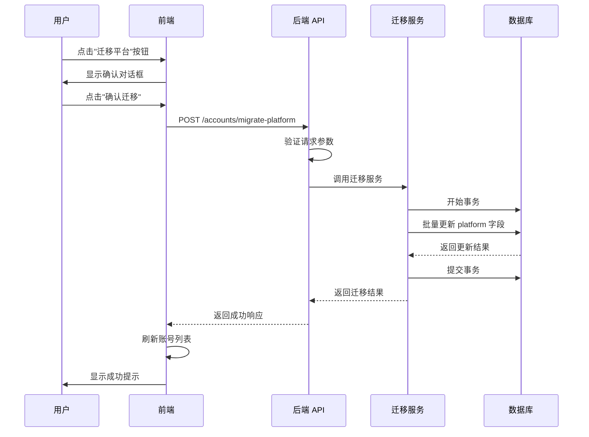

# 账号平台迁移使用指南

## 概述

账号平台迁移功能允许您将账号从一个平台迁移到另一个平台。当前主要用于将 `gpt_hero_sms` 平台的账号迁移到 `chatgpt` 平台。此功能通过友好的 Web 界面提供，支持批量迁移和选择性迁移，确保数据完整性和操作安全性。

## 功能特点

- ✅ 支持批量迁移所有账号
- ✅ 支持选择性迁移指定账号
- ✅ 数据完整性保证（事务回滚机制）
- ✅ 友好的确认对话框
- ✅ 实时进度反馈
- ✅ 自动刷新账号列表
- ✅ 详细的操作日志记录

## 使用步骤

### 第一步：进入账号管理页面

1. 打开系统 Web 界面（默认地址：`http://localhost:8000`）
2. 在左侧导航菜单中点击"平台管理"
3. 在平台列表中选择 `gpt_hero_sms` 平台
4. 系统会显示该平台下的所有账号列表

**注意**：迁移按钮仅在 `gpt_hero_sms` 平台页面显示，其他平台不会显示此按钮。

### 第二步：选择迁移方式

系统提供两种迁移方式，您可以根据需求选择：

#### 方式一：迁移所有账号（批量迁移）

**适用场景**：需要将该平台下的所有账号一次性迁移到目标平台。

**操作步骤**：
1. 确保没有选中任何账号（取消所有复选框）
2. 在页面右上方找到"迁移平台"按钮
3. 按钮会显示可迁移的账号总数，例如：
   - `迁移所有账号 (5)` - 表示将迁移 5 个账号
   - `迁移所有账号 (0)` - 表示没有可迁移的账号（按钮会被禁用）

**界面提示**：
- 按钮文案会根据账号数量动态更新
- 如果没有账号，按钮会显示为禁用状态（灰色）
- 账号数量显示在按钮文字后的括号中

#### 方式二：迁移选中的账号（选择性迁移）

**适用场景**：只需要迁移部分特定账号，保留其他账号在原平台。

**操作步骤**：
1. 在账号列表中，勾选需要迁移的账号（点击每行左侧的复选框）
2. 可以使用表头的复选框全选所有账号
3. 页面会显示已选中的账号数量，例如："已选 3 个"
4. 点击页面右上方的"迁移平台"按钮
5. 按钮文案会变为：`迁移所选账号 (3)` - 表示将迁移 3 个选中的账号

**选择技巧**：
- 可以使用搜索框过滤账号，然后选择需要的账号
- 可以使用状态筛选器筛选特定状态的账号
- 可以使用时间范围筛选器筛选特定时间段注册的账号
- 双击账号行可以查看详细信息

### 第三步：确认迁移操作

点击"迁移平台"按钮后，系统会弹出确认对话框，防止误操作。

**对话框内容**：

```
标题：迁移平台确认

⚠️ 此操作不可撤销
账号将从 gpt_hero_sms 平台迁移到 chatgpt 平台，迁移后将无法恢复。

迁移详情：
  源平台：gpt_hero_sms
  目标平台：chatgpt
  迁移账号数量：5 个
  迁移范围：所有账号（或"所选账号"）

[取消]  [确认迁移]
```

**对话框说明**：
- **警告信息**：黄色警告框提示操作不可撤销
- **源平台**：显示账号当前所在的平台（gpt_hero_sms）
- **目标平台**：显示账号将要迁移到的平台（chatgpt）
- **迁移账号数量**：显示将要迁移的账号总数
- **迁移范围**：
  - "所有账号" - 如果未选中任何账号
  - "所选账号" - 如果选中了特定账号
- **操作按钮**：
  - "取消" - 关闭对话框，不执行迁移
  - "确认迁移" - 执行迁移操作（主要按钮，蓝色）

**请仔细确认以下信息**：
1. ✅ 迁移账号数量是否正确
2. ✅ 迁移范围是否符合预期
3. ✅ 是否已做好数据备份（大批量迁移时）
4. ✅ 是否在业务低峰期执行

### 第四步：执行迁移

确认信息无误后，点击"确认迁移"按钮开始执行迁移。

**迁移过程中的界面变化**：

1. **加载指示器**：
   - "确认迁移"按钮会显示加载动画（旋转图标）
   - 按钮文字保持为"确认迁移"
   - 按钮变为禁用状态，防止重复点击

2. **进度提示**：
   - 对话框保持打开状态
   - 系统在后台执行迁移操作
   - 迁移时间取决于账号数量（通常几秒到十几秒）

3. **不要执行的操作**：
   - ❌ 不要关闭浏览器窗口
   - ❌ 不要刷新页面
   - ❌ 不要点击浏览器的后退按钮
   - ❌ 不要重复点击"确认迁移"按钮

### 第五步：查看结果

迁移完成后，系统会自动显示结果并更新界面。

#### 迁移成功

**界面反馈**：
- ✅ 弹出绿色成功提示："成功迁移 5 个账号"
- ✅ 确认对话框自动关闭
- ✅ 账号列表自动刷新
- ✅ 选中状态自动清除
- ✅ 迁移的账号从列表中消失（已移至 chatgpt 平台）

**验证步骤**：
1. 检查 gpt_hero_sms 平台的账号数量是否减少
2. 切换到 chatgpt 平台，查看迁移的账号是否出现
3. 在 chatgpt 平台中验证账号信息是否完整

#### 迁移失败

**界面反馈**：
- ❌ 弹出红色错误提示："迁移失败: [错误原因]"
- ❌ 确认对话框保持打开状态
- ❌ 账号列表不会刷新
- ❌ 所有数据保持原状（事务已回滚）

**常见错误原因**：
- 网络连接中断
- 数据库锁定
- 参数验证失败
- 超过最大账号数量限制（1000个）
- 服务器内部错误

**失败后的处理**：
1. 查看错误消息，了解失败原因
2. 解决问题后，可以重新尝试迁移
3. 如果问题持续，请查看后端日志或联系技术支持
4. 数据不会丢失，可以安全重试


## 界面说明

### 账号管理页面布局

```
┌─────────────────────────────────────────────────────────────────┐
│ 平台管理 > gpt_hero_sms                                          │
├─────────────────────────────────────────────────────────────────┤
│ [搜索邮箱...] [状态筛选▼] [开始时间] [结束时间] 5 个账号 已选 2 个│
│                                                                  │
│ [迁移所选账号 (2)] [导入] [导出] [新增] [注册] [刷新]           │
├─────────────────────────────────────────────────────────────────┤
│ ☑ 邮箱              密码      状态    注册时间      操作         │
│ ☑ user1@example.com ******* registered 2024-01-15  详情 删除   │
│ ☑ user2@example.com ******* registered 2024-01-16  详情 删除   │
│ ☐ user3@example.com ******* registered 2024-01-17  详情 删除   │
│ ☐ user4@example.com ******* registered 2024-01-18  详情 删除   │
│ ☐ user5@example.com ******* registered 2024-01-19  详情 删除   │
└─────────────────────────────────────────────────────────────────┘
```

### 迁移按钮显示规则

迁移按钮的显示和文案会根据以下条件动态变化：

| 条件 | 按钮显示 | 按钮状态 |
|------|---------|---------|
| 在 gpt_hero_sms 平台 + 有账号 + 未选中 | `迁移所有账号 (5)` | 启用（蓝色） |
| 在 gpt_hero_sms 平台 + 有账号 + 已选中 | `迁移所选账号 (2)` | 启用（蓝色） |
| 在 gpt_hero_sms 平台 + 无账号 | `迁移所有账号 (0)` | 禁用（灰色） |
| 在其他平台（chatgpt、kiro 等） | 不显示 | - |

**按钮位置**：页面右上方，位于"导入"按钮左侧

**按钮样式**：
- 类型：主要按钮（Primary Button）
- 颜色：蓝色（启用时）/ 灰色（禁用时）
- 图标：无
- 大小：标准尺寸

### 确认对话框详细说明

#### 对话框结构

```
┌─────────────────────────────────────────────────────┐
│ 迁移平台确认                                    [×] │
├─────────────────────────────────────────────────────┤
│                                                      │
│ ⚠️ 此操作不可撤销                                   │
│ 账号将从 gpt_hero_sms 平台迁移到 chatgpt 平台，     │
│ 迁移后将无法恢复。                                   │
│                                                      │
│ 迁移详情：                                           │
│   源平台：gpt_hero_sms                              │
│   目标平台：chatgpt                                 │
│   迁移账号数量：5 个                                │
│   迁移范围：所有账号                                │
│                                                      │
│                              [取消] [确认迁移]      │
└─────────────────────────────────────────────────────┘
```

#### 对话框元素说明

1. **标题栏**：
   - 文字："迁移平台确认"
   - 右上角有关闭按钮（×）

2. **警告区域**：
   - 黄色背景的警告框
   - 图标：⚠️ 警告图标
   - 主标题："此操作不可撤销"（粗体）
   - 描述文字："账号将从 gpt_hero_sms 平台迁移到 chatgpt 平台，迁移后将无法恢复。"

3. **详情区域**：
   - 标题："迁移详情："（粗体）
   - 信息列表（左对齐，带缩进）：
     - 源平台：显示当前平台名称
     - 目标平台：显示目标平台名称
     - 迁移账号数量：显示数字 + "个"
     - 迁移范围：显示"所有账号"或"所选账号"

4. **按钮区域**：
   - "取消"按钮：
     - 位置：右下角左侧
     - 样式：默认按钮（白色背景）
     - 功能：关闭对话框，不执行迁移
   - "确认迁移"按钮：
     - 位置：右下角右侧
     - 样式：主要按钮（蓝色背景）
     - 功能：执行迁移操作
     - 加载状态：显示旋转图标

#### 对话框交互行为

| 操作 | 行为 |
|------|------|
| 点击"取消"按钮 | 关闭对话框，返回账号列表，不执行任何操作 |
| 点击右上角"×"按钮 | 同"取消"按钮 |
| 点击对话框外部区域 | 无反应（maskClosable=false，防止误操作） |
| 按 ESC 键 | 关闭对话框（同"取消"按钮） |
| 点击"确认迁移"按钮 | 开始执行迁移，按钮显示加载状态 |
| 迁移进行中 | 按钮禁用，显示加载动画，对话框保持打开 |
| 迁移成功 | 显示成功提示，对话框自动关闭，列表刷新 |
| 迁移失败 | 显示错误提示，对话框保持打开，可重试 |

### 筛选和搜索功能

在执行迁移前，您可以使用以下功能来筛选和查找账号：

#### 1. 邮箱搜索

- **位置**：页面左上方第一个输入框
- **占位符**："搜索邮箱..."
- **功能**：按邮箱地址模糊搜索
- **使用方法**：
  1. 在搜索框中输入邮箱关键词
  2. 按回车键或点击搜索图标
  3. 列表会只显示匹配的账号
  4. 点击清除按钮（×）可清除搜索条件

#### 2. 状态筛选

- **位置**：搜索框右侧的下拉选择器
- **占位符**："状态筛选"
- **可选值**：
  - 已注册（registered）
  - 试用中（trial）
  - 已订阅（subscribed）
  - 已过期（expired）
  - 已失效（invalid）
- **使用方法**：
  1. 点击下拉框
  2. 选择要筛选的状态
  3. 列表会只显示该状态的账号
  4. 点击清除按钮（×）可清除筛选条件

#### 3. 时间范围筛选

- **位置**：状态筛选器右侧的两个日期选择器
- **功能**：按注册时间范围筛选账号
- **使用方法**：
  1. 点击"开始时间"选择器，选择起始日期和时间
  2. 点击"结束时间"选择器，选择结束日期和时间
  3. 列表会只显示该时间范围内注册的账号
  4. 点击清除按钮（×）可清除时间条件

**注意**：开始时间不能晚于结束时间，否则会显示警告提示。

#### 4. 组合筛选

您可以同时使用多个筛选条件，系统会显示同时满足所有条件的账号。

**示例**：
- 搜索邮箱包含"test"
- 状态为"已注册"
- 注册时间在 2024-01-01 到 2024-01-31 之间
- 结果：只显示符合所有条件的账号

### 账号统计信息

页面会实时显示以下统计信息：

- **总账号数**：显示在筛选器右侧，例如："5 个账号"
- **已选账号数**：当选中账号时显示，例如："已选 2 个"（绿色文字）
- **迁移按钮数字**：显示在按钮文字后，例如："迁移所有账号 (5)"

这些数字会根据筛选条件和选择状态实时更新。


## 完整工作流程示例

### 示例 1：迁移所有账号

**场景**：您想将 gpt_hero_sms 平台下的所有账号一次性迁移到 chatgpt 平台。

**步骤**：

1. **准备阶段**
   ```
   - 访问 http://localhost:8000
   - 登录系统（如需要）
   - 点击左侧"平台管理"菜单
   ```

2. **选择平台**
   ```
   - 在平台列表中点击"gpt_hero_sms"
   - 等待账号列表加载完成
   - 确认显示的账号数量，例如："5 个账号"
   ```

3. **确认无选中**
   ```
   - 检查表头的复选框是否未选中
   - 确认没有任何账号行被选中
   - 此时按钮应显示："迁移所有账号 (5)"
   ```

4. **执行迁移**
   ```
   - 点击"迁移所有账号 (5)"按钮
   - 在弹出的确认对话框中检查信息：
     ✓ 源平台：gpt_hero_sms
     ✓ 目标平台：chatgpt
     ✓ 迁移账号数量：5 个
     ✓ 迁移范围：所有账号
   - 点击"确认迁移"按钮
   ```

5. **等待完成**
   ```
   - 观察按钮的加载动画
   - 不要关闭浏览器或刷新页面
   - 等待成功提示："成功迁移 5 个账号"
   ```

6. **验证结果**
   ```
   - gpt_hero_sms 平台账号列表应为空（或显示"0 个账号"）
   - 切换到 chatgpt 平台
   - 确认 5 个账号已出现在列表中
   - 检查账号信息是否完整（邮箱、密码、状态等）
   ```

### 示例 2：迁移特定账号

**场景**：您只想迁移部分测试账号，保留生产账号在原平台。

**步骤**：

1. **筛选目标账号**
   ```
   - 进入 gpt_hero_sms 平台页面
   - 在搜索框输入"test"，筛选测试账号
   - 或使用状态筛选器选择"已注册"状态
   - 列表显示符合条件的账号
   ```

2. **选择账号**
   ```
   - 逐个勾选要迁移的账号
   - 或点击表头复选框全选当前页面的账号
   - 观察右上角显示："已选 3 个"
   - 按钮文案变为："迁移所选账号 (3)"
   ```

3. **执行迁移**
   ```
   - 点击"迁移所选账号 (3)"按钮
   - 在确认对话框中检查：
     ✓ 迁移账号数量：3 个
     ✓ 迁移范围：所选账号
   - 点击"确认迁移"
   ```

4. **验证结果**
   ```
   - 成功提示："成功迁移 3 个账号"
   - gpt_hero_sms 平台剩余账号数量减少 3 个
   - 选中状态自动清除
   - 切换到 chatgpt 平台验证迁移的账号
   ```

### 示例 3：分批迁移大量账号

**场景**：您有 500 个账号需要迁移，为了安全起见，决定分批执行。

**步骤**：

1. **第一批：测试迁移（10个账号）**
   ```
   - 进入 gpt_hero_sms 平台
   - 选择前 10 个账号
   - 执行迁移："迁移所选账号 (10)"
   - 验证迁移成功
   - 在 chatgpt 平台检查账号功能是否正常
   ```

2. **第二批：小批量迁移（50个账号）**
   ```
   - 确认第一批迁移无问题
   - 选择接下来的 50 个账号
   - 执行迁移："迁移所选账号 (50)"
   - 验证迁移成功
   ```

3. **第三批：大批量迁移（200个账号）**
   ```
   - 确认前两批迁移稳定
   - 选择接下来的 200 个账号
   - 执行迁移："迁移所选账号 (200)"
   - 观察迁移时间（应在 10 秒内完成）
   ```

4. **最后批次：剩余账号**
   ```
   - 不选择任何账号
   - 点击"迁移所有账号 (240)"
   - 迁移剩余的所有账号
   - 最终验证 gpt_hero_sms 平台账号为 0
   ```

### 示例 4：按时间范围迁移

**场景**：您想迁移最近一周注册的账号，保留旧账号。

**步骤**：

1. **设置时间筛选**
   ```
   - 进入 gpt_hero_sms 平台
   - 点击"开始时间"选择器
   - 选择 7 天前的日期和时间
   - 点击"结束时间"选择器
   - 选择当前日期和时间
   - 列表显示最近 7 天注册的账号
   ```

2. **全选并迁移**
   ```
   - 点击表头复选框，全选筛选结果
   - 观察选中数量，例如："已选 15 个"
   - 点击"迁移所选账号 (15)"
   - 确认并执行迁移
   ```

3. **清除筛选验证**
   ```
   - 清除时间筛选条件
   - 查看剩余账号（应该是 7 天前注册的账号）
   - 切换到 chatgpt 平台
   - 验证迁移的 15 个账号
   ```

## 注意事项

### ⚠️ 重要提示

1. **不可撤销性**
   - 迁移操作完成后无法通过前端界面自动撤销
   - 如需回滚，必须使用数据库备份或手动操作
   - 执行前请务必确认迁移范围和账号数量

2. **数据备份**
   - 建议在执行大批量迁移前先备份数据库
   - 备份命令：`python scripts/backup_database.py --type full`
   - 备份文件保存在 `./backups` 目录

3. **账号数量限制**
   - 单次最多迁移 1000 个账号
   - 如果超过限制，系统会返回错误
   - 建议分批迁移大量账号

4. **网络稳定性**
   - 确保网络连接稳定
   - 避免在网络不稳定时执行迁移
   - 迁移过程中不要关闭浏览器或刷新页面

5. **业务影响**
   - 迁移仅更新数据库中的 platform 字段
   - 不会影响账号的 token、状态等信息
   - 但建议在业务低峰期执行迁移操作

6. **并发操作**
   - 避免多个用户同时对同一批账号执行迁移
   - 系统使用数据库事务保证数据一致性
   - 但并发操作可能导致部分请求失败

### 数据保留说明

迁移操作会保留以下所有数据：

| 字段 | 说明 | 是否保留 |
|------|------|---------|
| email | 邮箱地址 | ✅ 保留 |
| password | 密码 | ✅ 保留 |
| user_id | 用户 ID | ✅ 保留 |
| region | 地区 | ✅ 保留 |
| token | Access Token | ✅ 保留 |
| status | 账号状态 | ✅ 保留 |
| extra_json | 额外信息（包括 refresh_token 等） | ✅ 保留 |
| created_at | 创建时间 | ✅ 保留 |
| platform | 平台标识 | 🔄 更新为 chatgpt |
| updated_at | 更新时间 | 🔄 更新为当前时间 |

**重要**：迁移操作仅更新 `platform` 和 `updated_at` 两个字段，所有其他数据完全保留。

### 迁移后的账号状态

迁移完成后，账号将：

- ✅ 在 chatgpt 平台列表中显示
- ✅ 保留所有原有功能和数据
- ✅ 支持 chatgpt 平台的所有操作（状态探测、CLIProxyAPI 同步等）
- ✅ 可以正常使用 Access Token 和 Refresh Token
- ❌ 在 gpt_hero_sms 平台列表中不再显示

**功能验证**：
- 可以在 chatgpt 平台执行"探测本地状态"操作
- 可以执行"同步 CLIProxyAPI 状态"操作
- 可以执行"补传远端未发现"操作
- 所有 chatgpt 平台特有的功能都可以正常使用

## 常见问题

### Q1: 迁移失败怎么办？

**A**: 迁移失败时，系统会自动回滚所有更改，账号数据不会受到影响。请检查错误消息，解决问题后重试。

**常见失败原因及解决方法**：

| 错误类型 | 可能原因 | 解决方法 |
|---------|---------|---------|
| 网络连接中断 | 网络不稳定、服务器无响应 | 检查网络连接，刷新页面后重试 |
| 数据库锁定 | 其他操作正在进行 | 等待几秒后重试 |
| 参数验证失败 | 账号数量超过限制（>1000） | 分批迁移，每批不超过 1000 个 |
| 未授权访问 | 登录会话过期 | 重新登录后重试 |
| 服务器内部错误 | 后端服务异常 | 查看后端日志，联系技术支持 |

**失败后的数据状态**：
- ✅ 所有账号数据保持原状
- ✅ platform 字段未被修改
- ✅ 可以安全地重新尝试迁移
- ✅ 不会出现部分迁移的情况（事务保证）

### Q2: 可以迁移到其他平台吗？

**A**: 当前版本仅支持从 gpt_hero_sms 迁移到 chatgpt。未来版本可能会支持更多平台间的迁移。

**技术限制**：
- 源平台：固定为 gpt_hero_sms
- 目标平台：固定为 chatgpt
- 原因：不同平台的数据结构和字段要求可能不同

**如需其他平台迁移**：
- 可以使用数据库管理工具手动修改 platform 字段
- 或联系开发团队添加新的迁移路径支持

### Q3: 迁移后可以回滚吗？

**A**: 前端界面不提供自动回滚功能，但您可以通过以下方式回滚：

#### 方法 1：使用数据库备份恢复

```bash
# 1. 停止后端服务
python stop_backend.py

# 2. 恢复备份
cp backups/account_manager_backup_20240115.db account_manager.db

# 3. 重启后端服务
python start_backend.py
```

#### 方法 2：使用回滚脚本（按时间）

```bash
# 回滚最近 1 小时内的迁移
python scripts/rollback_migration.py --mode time --hours 1

# 回滚最近 24 小时内的迁移
python scripts/rollback_migration.py --mode time --hours 24
```

#### 方法 3：使用回滚脚本（按账号 ID）

```bash
# 回滚指定账号
python scripts/rollback_migration.py --mode ids --account-ids 1,2,3,4,5
```

#### 方法 4：手动 SQL 操作

```sql
-- 查看最近迁移的账号
SELECT id, email, platform, updated_at 
FROM accounts 
WHERE platform = 'chatgpt' 
  AND updated_at > '2024-01-15 10:00:00'
ORDER BY updated_at DESC;

-- 回滚指定账号
UPDATE accounts 
SET platform = 'gpt_hero_sms', 
    updated_at = NOW()
WHERE id IN (1, 2, 3, 4, 5);

-- 回滚最近 1 小时的迁移
UPDATE accounts 
SET platform = 'gpt_hero_sms', 
    updated_at = NOW()
WHERE platform = 'chatgpt' 
  AND updated_at > datetime('now', '-1 hour');
```

**注意**：手动回滚后需要刷新前端页面才能看到更新。

### Q4: 迁移需要多长时间？

**A**: 迁移时间取决于账号数量和服务器性能。

**性能参考**：

| 账号数量 | 预计时间 | 说明 |
|---------|---------|------|
| 1-10 个 | 1-2 秒 | 几乎瞬间完成 |
| 10-100 个 | 2-5 秒 | 快速完成 |
| 100-500 个 | 5-10 秒 | 正常速度 |
| 500-1000 个 | 10-15 秒 | 可接受范围 |
| >1000 个 | 不支持 | 需要分批迁移 |

**影响因素**：
- 数据库类型（SQLite 比 PostgreSQL 慢）
- 服务器性能（CPU、内存、磁盘 I/O）
- 并发操作（其他用户是否在操作数据库）
- 网络延迟（前端到后端的网络速度）

**性能优化**：
- 系统使用批量更新操作，而非逐个更新
- 利用数据库索引加速查询
- 在单个事务中执行所有操作
- 最小化数据库锁定时间

### Q5: 迁移过程中可以取消吗？

**A**: 一旦点击"确认迁移"按钮，迁移操作就会立即执行，无法中途取消。

**原因**：
- 迁移操作在数据库事务中执行
- 事务要么全部成功，要么全部失败
- 不支持部分提交或中途取消

**建议**：
- 在点击"确认迁移"前仔细检查迁移范围
- 如果不确定，可以先迁移少量账号测试
- 大批量迁移建议分批执行

**如果误操作**：
- 等待迁移完成（通常很快）
- 使用回滚脚本恢复数据
- 或从数据库备份恢复

### Q6: 迁移会影响正在使用的账号吗？

**A**: 迁移仅更新数据库中的 platform 字段，不会影响账号的 token、状态等信息。但建议在业务低峰期执行迁移操作。

**影响分析**：

| 方面 | 是否影响 | 说明 |
|------|---------|------|
| Access Token | ❌ 不影响 | Token 值保持不变 |
| Refresh Token | ❌ 不影响 | Refresh Token 保持不变 |
| 账号状态 | ❌ 不影响 | 状态字段保持不变 |
| 正在进行的 API 调用 | ❌ 不影响 | 不会中断现有连接 |
| 平台显示 | ✅ 影响 | 账号会从源平台移到目标平台 |
| 平台特定功能 | ✅ 影响 | 可以使用目标平台的功能 |

**最佳实践**：
- 选择业务低峰期执行迁移
- 避免在账号正在执行任务时迁移
- 迁移后验证账号功能是否正常
- 如有问题，及时回滚

### Q7: 为什么迁移按钮不显示？

**A**: 迁移按钮仅在 gpt_hero_sms 平台页面显示。

**检查清单**：

1. **确认当前平台**
   ```
   - 查看页面顶部的平台名称
   - 应该显示"平台管理 > gpt_hero_sms"
   - 如果是其他平台，切换到 gpt_hero_sms
   ```

2. **刷新页面**
   ```
   - 按 F5 或点击浏览器刷新按钮
   - 清除浏览器缓存（Ctrl+Shift+Delete）
   - 重新登录系统
   ```

3. **检查浏览器控制台**
   ```
   - 按 F12 打开开发者工具
   - 切换到 Console 标签
   - 查看是否有 JavaScript 错误
   - 如有错误，截图并联系技术支持
   ```

4. **检查后端服务**
   ```
   - 确认后端服务正在运行
   - 访问 http://localhost:8000/api/config
   - 应该返回配置信息，而非错误
   ```

### Q8: 迁移后账号在两个平台都不显示怎么办？

**A**: 这种情况通常是前端缓存问题，不是数据丢失。

**解决步骤**：

1. **刷新页面**
   ```
   - 按 F5 刷新当前页面
   - 或按 Ctrl+F5 强制刷新（清除缓存）
   ```

2. **切换平台**
   ```
   - 切换到其他平台（如 kiro）
   - 再切换回 chatgpt 平台
   - 查看账号是否出现
   ```

3. **清除浏览器缓存**
   ```
   - 按 Ctrl+Shift+Delete
   - 选择"缓存的图片和文件"
   - 点击"清除数据"
   - 刷新页面
   ```

4. **检查数据库**
   ```sql
   -- 查询账号的 platform 字段
   SELECT id, email, platform, updated_at 
   FROM accounts 
   WHERE email = 'your_email@example.com';
   ```

5. **重启后端服务**
   ```bash
   # Windows
   .\stop_backend.ps1
   .\start_backend.ps1
   
   # Linux/Mac
   ./stop_backend.sh
   ./start_backend.sh
   ```

**如果问题持续**：
- 查看后端日志文件
- 检查数据库文件是否损坏
- 联系技术支持并提供错误信息

### Q9: 可以同时迁移多个平台的账号吗？

**A**: 不可以。当前版本仅支持单个平台的迁移操作。

**限制说明**：
- 每次只能在一个平台页面操作
- 只能迁移当前平台的账号
- 不支持跨平台批量选择

**如需迁移多个平台**：
- 依次进入每个平台页面
- 分别执行迁移操作
- 或使用数据库脚本批量操作

### Q10: 迁移失败后，部分账号已迁移怎么办？

**A**: 这种情况不应该发生。系统使用数据库事务保证原子性，要么全部成功，要么全部失败。

**如果真的发生**：

1. **确认是否真的部分迁移**
   ```sql
   -- 检查迁移状态
   SELECT platform, COUNT(*) as count
   FROM accounts
   WHERE email LIKE '%test%'  -- 替换为您的筛选条件
   GROUP BY platform;
   ```

2. **可能的原因**：
   - 多个用户同时操作同一批账号
   - 数据库连接在事务提交时中断
   - 数据库事务隔离级别配置问题

3. **解决方法**：
   - 使用回滚脚本恢复到迁移前状态
   - 或手动完成剩余账号的迁移
   - 联系技术支持分析日志

4. **预防措施**：
   - 避免多人同时操作
   - 确保网络连接稳定
   - 定期备份数据库

## 技术细节

### 迁移流程

1. 前端发送迁移请求到 `/api/accounts/migrate-platform`
2. 后端验证请求参数
3. 在数据库事务中执行批量更新
4. 验证所有账号的 platform 字段已更新
5. 提交事务并返回结果
6. 前端显示结果并刷新列表

### 数据库操作

```sql
-- 批量迁移示例
UPDATE accounts 
SET platform = 'chatgpt', 
    updated_at = CURRENT_TIMESTAMP
WHERE platform = 'gpt_hero_sms'
AND id IN (1, 2, 3);  -- 如果指定了账号 ID
```

### 事务保证

- 所有更新操作在单个事务中执行
- 任何失败都会触发完整回滚
- 保证数据一致性

## 最佳实践

### 1. 迁移前准备

- ✅ 确认要迁移的账号范围
- ✅ 检查目标平台是否正常运行
- ✅ 备份数据库（大批量迁移时）
- ✅ 选择业务低峰期执行

### 2. 迁移执行

- ✅ 先测试少量账号迁移
- ✅ 确认测试成功后再批量迁移
- ✅ 保持网络连接稳定
- ✅ 不要在迁移过程中关闭浏览器

### 3. 迁移后验证

- ✅ 检查迁移的账号数量是否正确
- ✅ 在目标平台验证账号显示正常
- ✅ 在源平台确认账号已不显示
- ✅ 测试迁移后的账号功能是否正常

### 4. 分批迁移策略

如果有大量账号需要迁移，建议分批执行：

1. 第一批：迁移 10-20 个账号测试
2. 第二批：迁移 100 个账号验证性能
3. 后续批次：每次迁移 500-1000 个账号

## 故障排查

### 问题 1：迁移按钮不显示

**症状**：在 gpt_hero_sms 平台页面看不到"迁移平台"按钮。

**排查步骤**：

1. **确认当前平台**
   ```
   检查项：页面顶部是否显示"平台管理 > gpt_hero_sms"
   预期结果：应该显示 gpt_hero_sms
   如果不是：点击左侧菜单切换到 gpt_hero_sms 平台
   ```

2. **检查账号数量**
   ```
   检查项：页面是否显示"X 个账号"
   预期结果：应该显示账号数量（可以是 0）
   如果没有：说明数据加载失败，刷新页面
   ```

3. **刷新页面**
   ```
   操作：按 F5 或点击浏览器刷新按钮
   预期结果：页面重新加载，按钮应该出现
   如果仍然没有：继续下一步
   ```

4. **清除浏览器缓存**
   ```
   操作：按 Ctrl+Shift+Delete，清除缓存
   预期结果：缓存清除后，刷新页面应该正常
   如果仍然没有：继续下一步
   ```

5. **检查浏览器控制台**
   ```
   操作：按 F12，切换到 Console 标签
   检查项：是否有红色错误信息
   常见错误：
     - "Failed to fetch" - 后端服务未运行
     - "Unexpected token" - 前端代码错误
     - "Network error" - 网络连接问题
   ```

6. **检查后端服务**
   ```
   操作：访问 http://localhost:8000/api/config
   预期结果：应该返回 JSON 配置信息
   如果返回错误：后端服务未正常运行，需要重启
   ```

**解决方案**：
- 如果是平台错误：切换到正确的平台
- 如果是缓存问题：清除缓存并刷新
- 如果是后端问题：重启后端服务
- 如果是代码错误：联系技术支持

### 问题 2：迁移失败，提示"单次最多迁移 1000 个账号"

**症状**：点击"确认迁移"后，显示错误："单次最多迁移 1000 个账号"。

**原因**：系统限制单次迁移的最大账号数量为 1000 个，防止长时间锁定数据库。

**解决方案**：

**方法 1：分批迁移（推荐）**
```
1. 第一批：选择前 1000 个账号
   - 使用时间筛选或手动选择
   - 执行迁移
   
2. 第二批：选择接下来的 1000 个账号
   - 重复上述步骤
   
3. 最后批次：迁移剩余账号
   - 不选择任何账号
   - 点击"迁移所有账号"
```

**方法 2：使用数据库脚本**
```bash
# 如果账号数量远超 1000，可以使用脚本直接操作数据库
python scripts/migrate_platform.py \
  --source gpt_hero_sms \
  --target chatgpt \
  --batch-size 1000
```

**方法 3：手动 SQL 操作**
```sql
-- 直接更新所有账号（谨慎使用）
UPDATE accounts 
SET platform = 'chatgpt', 
    updated_at = CURRENT_TIMESTAMP
WHERE platform = 'gpt_hero_sms';
```

### 问题 3：迁移后账号在两个平台都不显示

**症状**：迁移成功后，账号既不在 gpt_hero_sms 也不在 chatgpt 平台显示。

**原因**：通常是前端缓存或状态同步问题，数据实际上是正常的。

**排查步骤**：

1. **刷新页面**
   ```
   操作：按 F5 刷新页面
   预期结果：账号应该出现在 chatgpt 平台
   ```

2. **切换平台**
   ```
   操作：
     1. 切换到其他平台（如 kiro）
     2. 再切换回 chatgpt 平台
   预期结果：账号列表重新加载，应该显示迁移的账号
   ```

3. **清除浏览器缓存**
   ```
   操作：Ctrl+Shift+Delete，清除缓存
   预期结果：缓存清除后，账号应该正常显示
   ```

4. **检查数据库**
   ```sql
   -- 查询账号的实际 platform 值
   SELECT id, email, platform, updated_at 
   FROM accounts 
   WHERE email = 'your_email@example.com';
   
   -- 预期结果：platform 应该是 'chatgpt'
   ```

5. **检查筛选条件**
   ```
   检查项：
     - 搜索框是否有内容
     - 状态筛选器是否选中
     - 时间范围是否设置
   操作：清除所有筛选条件
   预期结果：应该显示所有账号
   ```

**解决方案**：
- 如果数据库中 platform 正确：清除前端缓存
- 如果 platform 不正确：使用回滚脚本修复
- 如果筛选条件导致：清除筛选条件

### 问题 4：迁移成功但列表未刷新

**症状**：显示"成功迁移 X 个账号"，但账号列表没有更新。

**原因**：前端自动刷新失败，可能是网络延迟或状态管理问题。

**解决方案**：

**方法 1：手动刷新**
```
操作：点击页面右上角的刷新按钮（🔄图标）
预期结果：列表重新加载，显示最新数据
```

**方法 2：强制刷新页面**
```
操作：按 Ctrl+F5（Windows）或 Cmd+Shift+R（Mac）
预期结果：页面完全重新加载，包括所有资源
```

**方法 3：切换平台**
```
操作：
  1. 切换到 chatgpt 平台
  2. 查看迁移的账号是否出现
  3. 切换回 gpt_hero_sms 平台
  4. 确认账号已消失
```

**预防措施**：
- 确保网络连接稳定
- 不要在迁移过程中切换页面
- 等待成功提示出现后再进行其他操作

### 问题 5：迁移时显示"网络连接失败"

**症状**：点击"确认迁移"后，显示"迁移失败: 网络连接失败"或类似错误。

**原因**：前端无法连接到后端 API 服务。

**排查步骤**：

1. **检查后端服务状态**
   ```bash
   # Windows
   netstat -ano | findstr :8000
   
   # Linux/Mac
   lsof -i :8000
   
   # 预期结果：应该显示进程正在监听 8000 端口
   ```

2. **测试 API 连接**
   ```bash
   # 使用 curl 测试
   curl http://localhost:8000/api/config
   
   # 预期结果：返回 JSON 配置信息
   # 如果失败：后端服务未运行或端口被占用
   ```

3. **检查防火墙设置**
   ```
   检查项：防火墙是否阻止了 8000 端口
   操作：临时关闭防火墙测试
   预期结果：如果关闭防火墙后正常，需要添加防火墙规则
   ```

4. **检查浏览器网络面板**
   ```
   操作：
     1. 按 F12 打开开发者工具
     2. 切换到 Network 标签
     3. 重新执行迁移操作
     4. 查看 /accounts/migrate-platform 请求
   
   常见错误：
     - Status: (failed) - 网络连接失败
     - Status: 500 - 服务器内部错误
     - Status: 404 - API 端点不存在
   ```

**解决方案**：
- 如果后端未运行：启动后端服务
- 如果端口被占用：更改端口或停止占用进程
- 如果防火墙阻止：添加防火墙规则
- 如果 API 错误：查看后端日志

### 问题 6：迁移时显示"数据库锁定"错误

**症状**：迁移失败，错误消息包含"database is locked"或"数据库锁定"。

**原因**：其他操作正在访问数据库，导致迁移操作无法获取锁。

**常见场景**：
- 其他用户正在执行迁移或批量操作
- 正在执行账号注册任务
- 数据库备份正在进行
- 其他进程正在访问数据库文件

**解决方案**：

**方法 1：等待并重试**
```
操作：等待 10-30 秒后重新尝试迁移
原因：大多数操作会在短时间内完成
预期结果：第二次尝试应该成功
```

**方法 2：检查正在进行的任务**
```
操作：
  1. 切换到"任务历史"页面
  2. 查看是否有正在进行的注册任务
  3. 等待任务完成后再迁移
```

**方法 3：重启后端服务**
```bash
# Windows
.\stop_backend.ps1
.\start_backend.ps1

# Linux/Mac
./stop_backend.sh
./start_backend.sh

# 注意：重启会中断所有正在进行的操作
```

**方法 4：检查数据库连接**
```bash
# 查看数据库文件是否被锁定
# Windows
handle account_manager.db

# Linux
lsof account_manager.db

# 如果有其他进程占用，需要关闭该进程
```

**预防措施**：
- 避免多人同时操作
- 在业务低峰期执行迁移
- 不要在注册任务进行时迁移
- 使用 PostgreSQL 代替 SQLite（更好的并发支持）

### 问题 7：迁移后账号功能异常

**症状**：迁移成功，账号出现在 chatgpt 平台，但某些功能无法使用。

**可能的问题**：

**问题 A：Access Token 无效**
```
症状：无法执行"探测本地状态"操作
原因：Token 可能已过期
解决：
  1. 在账号详情中查看 Token
  2. 如果 Token 过期，需要重新获取
  3. 或使用 Refresh Token 刷新
```

**问题 B：Refresh Token 丢失**
```
症状：无法刷新 Access Token
原因：extra_json 中的 refresh_token 字段为空
解决：
  1. 检查原账号是否有 Refresh Token
  2. 如果有，检查迁移是否保留了 extra_json
  3. 如果丢失，需要重新注册账号
```

**问题 C：CLIProxyAPI 同步失败**
```
症状：无法同步 CLIProxyAPI 状态
原因：CLIProxyAPI 服务未配置或未运行
解决：
  1. 检查 CLIProxyAPI 服务是否运行
  2. 检查配置是否正确
  3. 手动执行"同步 CLIProxyAPI 状态"操作
```

**验证步骤**：
```
1. 查看账号详情
   - 检查所有字段是否完整
   - 特别注意 token 和 extra_json

2. 执行"探测本地状态"
   - 检查认证状态
   - 检查订阅状态
   - 检查 Codex 状态

3. 执行"同步 CLIProxyAPI 状态"
   - 检查远端状态
   - 检查同步时间
   - 检查错误信息

4. 测试账号功能
   - 尝试使用 Token 访问 API
   - 验证账号权限
   - 检查订阅状态
```

### 问题 8：迁移按钮显示但点击无反应

**症状**：可以看到"迁移平台"按钮，但点击后没有任何反应。

**排查步骤**：

1. **检查按钮状态**
   ```
   检查项：按钮是否为灰色（禁用状态）
   原因：如果账号数量为 0，按钮会被禁用
   解决：确保有可迁移的账号
   ```

2. **检查浏览器控制台**
   ```
   操作：按 F12，切换到 Console 标签
   检查项：点击按钮时是否有错误信息
   常见错误：
     - "Cannot read property of undefined" - 前端代码错误
     - "Function not defined" - 事件处理函数缺失
   ```

3. **检查事件绑定**
   ```
   操作：在 Console 中执行
   document.querySelector('button').onclick
   
   预期结果：应该返回一个函数
   如果返回 null：事件未正确绑定
   ```

4. **尝试其他浏览器**
   ```
   操作：使用 Chrome、Firefox 或 Edge 测试
   原因：可能是浏览器兼容性问题
   ```

**解决方案**：
- 如果是禁用状态：确保有账号可迁移
- 如果是代码错误：清除缓存并刷新
- 如果是兼容性问题：更换浏览器
- 如果问题持续：联系技术支持

### 问题 9：迁移后数据不完整

**症状**：迁移成功，但某些字段的数据丢失或变为空。

**检查清单**：

```sql
-- 检查迁移前后的数据
-- 迁移前（在 gpt_hero_sms 平台）
SELECT * FROM accounts WHERE id = 123;

-- 迁移后（在 chatgpt 平台）
SELECT * FROM accounts WHERE id = 123;

-- 对比以下字段：
-- email, password, user_id, region, token, status, extra_json, created_at
```

**应该保留的字段**：
- ✅ email - 邮箱地址
- ✅ password - 密码
- ✅ user_id - 用户 ID
- ✅ region - 地区
- ✅ token - Access Token
- ✅ status - 账号状态
- ✅ extra_json - 额外信息（包括 refresh_token）
- ✅ created_at - 创建时间

**应该更新的字段**：
- 🔄 platform - 从 gpt_hero_sms 更新为 chatgpt
- 🔄 updated_at - 更新为当前时间

**如果数据丢失**：
1. 检查数据库备份
2. 使用备份恢复数据
3. 联系技术支持分析原因
4. 报告 Bug 以便修复

**预防措施**：
- 迁移前备份数据库
- 先测试少量账号
- 验证数据完整性后再大批量迁移

## 技术细节

### 迁移流程

完整的迁移流程包括以下步骤：



### 数据库操作

迁移操作在数据库层面执行以下 SQL：

```sql
-- 批量迁移（所有账号）
UPDATE accounts 
SET platform = 'chatgpt', 
    updated_at = CURRENT_TIMESTAMP
WHERE platform = 'gpt_hero_sms';

-- 选择性迁移（指定账号）
UPDATE accounts 
SET platform = 'chatgpt', 
    updated_at = CURRENT_TIMESTAMP
WHERE platform = 'gpt_hero_sms'
  AND id IN (1, 2, 3, 4, 5);
```

**事务保证**：
- 所有更新操作在单个事务中执行
- 使用 `BEGIN TRANSACTION` 和 `COMMIT` 包裹
- 任何错误都会触发 `ROLLBACK`
- 保证数据一致性（要么全部成功，要么全部失败）

**索引利用**：
- `platform` 字段有索引，加速 WHERE 条件查询
- `id` 主键索引，加速 IN 条件查询
- 批量更新比逐个更新快 10-100 倍

### API 端点详情

#### 请求

```http
POST /api/accounts/migrate-platform HTTP/1.1
Host: localhost:8000
Content-Type: application/json

{
  "source_platform": "gpt_hero_sms",
  "target_platform": "chatgpt",
  "account_ids": [1, 2, 3, 4, 5]  // 可选，null 表示迁移所有
}
```

#### 成功响应

```http
HTTP/1.1 200 OK
Content-Type: application/json

{
  "success": true,
  "migrated_count": 5,
  "failed_count": 0,
  "account_ids": [1, 2, 3, 4, 5],
  "error_message": null
}
```

#### 失败响应

```http
HTTP/1.1 400 Bad Request
Content-Type: application/json

{
  "success": false,
  "migrated_count": 0,
  "failed_count": 5,
  "account_ids": [],
  "error_message": "单次最多迁移 1000 个账号"
}
```

#### 错误代码

| HTTP 状态码 | 错误原因 | 解决方法 |
|-----------|---------|---------|
| 400 | 参数验证失败 | 检查请求参数是否正确 |
| 401 | 未授权访问 | 重新登录系统 |
| 500 | 服务器内部错误 | 查看后端日志，联系技术支持 |

### 前端实现

迁移功能的前端实现位于 `frontend/src/pages/Accounts.tsx`：

**关键组件**：
- `getMigrateButtonLabel()` - 动态生成按钮文案
- `handleMigratePlatform()` - 执行迁移操作
- `MigrationDialog` - 确认对话框组件

**状态管理**：
```typescript
const [migrateModalOpen, setMigrateModalOpen] = useState(false)
const [migrateLoading, setMigrateLoading] = useState(false)
const [selectedRowKeys, setSelectedRowKeys] = useState<React.Key[]>([])
```

**按钮显示逻辑**：
```typescript
{currentPlatform === 'gpt_hero_sms' && (
  <Button
    type="primary"
    onClick={() => setMigrateModalOpen(true)}
    disabled={total === 0}
  >
    {getMigrateButtonLabel()}
  </Button>
)}
```

### 后端实现

迁移功能的后端实现位于以下文件：

**API 端点**：`api/accounts.py`
```python
@router.post("/migrate-platform")
async def migrate_platform(
    request: MigratePlatformRequest,
    session: Session = Depends(get_session)
):
    # 验证参数
    # 调用迁移服务
    # 返回结果
```

**迁移服务**：`core/migration_service.py`
```python
class MigrationService:
    def migrate_accounts(
        self,
        session: Session,
        source_platform: str,
        target_platform: str,
        account_ids: Optional[list[int]] = None
    ) -> MigrationResult:
        # 开始事务
        # 批量更新
        # 提交事务
        # 记录日志
```

**数据模型**：
```python
class MigratePlatformRequest(BaseModel):
    source_platform: str = "gpt_hero_sms"
    target_platform: str = "chatgpt"
    account_ids: Optional[list[int]] = None

class MigratePlatformResponse(BaseModel):
    success: bool
    migrated_count: int
    failed_count: int
    account_ids: list[int]
    error_message: Optional[str] = None
```

### 性能优化

系统采用以下优化措施确保迁移性能：

1. **批量更新**
   ```sql
   -- 好的做法（批量更新）
   UPDATE accounts SET platform = 'chatgpt' WHERE id IN (1,2,3,...,1000);
   
   -- 不好的做法（逐个更新）
   UPDATE accounts SET platform = 'chatgpt' WHERE id = 1;
   UPDATE accounts SET platform = 'chatgpt' WHERE id = 2;
   -- ... 重复 1000 次
   ```

2. **索引利用**
   - `platform` 字段有索引
   - `id` 主键自动有索引
   - 查询和更新都能利用索引

3. **事务优化**
   - 单个事务包含所有更新
   - 减少事务开销
   - 最小化锁定时间

4. **连接池**
   - 使用数据库连接池
   - 避免频繁创建连接
   - 提高并发性能

### 安全考虑

迁移功能实现了以下安全措施：

1. **身份认证**
   - 所有请求必须通过身份认证
   - 使用现有的认证中间件
   - 未授权请求返回 401 错误

2. **参数验证**
   - 验证平台名称合法性
   - 验证账号 ID 列表格式
   - 限制单次迁移最大数量（1000）

3. **SQL 注入防护**
   - 使用 ORM（SQLModel）自动处理
   - 参数化查询
   - 不直接拼接 SQL 字符串

4. **事务隔离**
   - 使用数据库事务隔离级别
   - 防止并发冲突
   - 保证数据一致性

5. **审计日志**
   - 记录所有迁移操作
   - 包含操作时间、用户、账号数量
   - 记录成功和失败的迁移

### 日志记录

系统会记录以下迁移相关日志：

**成功日志**：
```
[2024-01-15 10:30:45] INFO: Migration started
  Source: gpt_hero_sms
  Target: chatgpt
  Account IDs: [1, 2, 3, 4, 5]
  Count: 5

[2024-01-15 10:30:46] INFO: Migration completed successfully
  Migrated: 5
  Failed: 0
  Duration: 1.2s
```

**失败日志**：
```
[2024-01-15 10:35:20] ERROR: Migration failed
  Source: gpt_hero_sms
  Target: chatgpt
  Account IDs: [1, 2, 3, ..., 1500]
  Error: 单次最多迁移 1000 个账号
  Duration: 0.1s
```

**日志位置**：
- 后端日志：控制台输出
- 审计日志：`logs/audit.log`（如果配置）
- 数据库日志：`logs/database.log`（如果配置）

## 支持

如果遇到问题，请按以下顺序寻求帮助：

### 1. 查看文档

- **本文档**：详细的使用说明和故障排查
- **API 文档**：`docs/API.md` - API 端点说明
- **最佳实践**：`docs/MIGRATION_BEST_PRACTICES.md` - 生产环境建议
- **部署指南**：`docs/DEPLOYMENT_GUIDE.md` - 完整的部署流程

### 2. 检查日志

**浏览器控制台**：
```
1. 按 F12 打开开发者工具
2. 切换到 Console 标签
3. 查看是否有错误信息
4. 截图保存错误信息
```

**后端日志**：
```bash
# 查看后端控制台输出
# 或查看日志文件
tail -f logs/app.log
```

**数据库日志**：
```bash
# 如果配置了数据库日志
tail -f logs/database.log
```

### 3. 自助排查

使用本文档的"故障排查"部分：
- 按症状查找对应的问题
- 按照排查步骤逐步检查
- 尝试提供的解决方案

### 4. 社区支持

**QQ 群**：1065114376（any-auto-register 注册机用户讨论群）
- 加入群聊
- 描述问题（包括错误信息、操作步骤）
- 上传截图或日志
- 等待社区成员回复

### 5. GitHub Issues

**项目地址**：https://github.com/zc-zhangchen/any-auto-register

**提交 Issue 时请包含**：
- 问题描述（详细的操作步骤）
- 错误信息（完整的错误消息）
- 环境信息（操作系统、Python 版本、浏览器版本）
- 截图或日志（如果有）
- 复现步骤（如何重现问题）

**Issue 模板**：
```markdown
### 问题描述
[详细描述遇到的问题]

### 复现步骤
1. 进入 gpt_hero_sms 平台
2. 选择 5 个账号
3. 点击"迁移所选账号"
4. 点击"确认迁移"
5. 出现错误

### 错误信息
```
[粘贴完整的错误消息]
```

### 环境信息
- 操作系统：Windows 11
- Python 版本：3.12.0
- 浏览器：Chrome 120.0
- 项目版本：v1.0.0

### 截图
[上传相关截图]

### 日志
[粘贴相关日志]
```

### 6. 技术支持

如果以上方式都无法解决问题，可以联系技术支持：
- 通过 QQ 群联系管理员
- 在 GitHub 上 @项目维护者
- 发送邮件到项目邮箱（如果有）

**注意**：
- 请先尝试自助排查
- 提供详细的问题描述和错误信息
- 耐心等待回复
- 尊重开源项目维护者的时间

## 更新日志

### v1.0.0 (2024-01-15)

**新功能**：
- ✨ 初始版本发布
- ✨ 支持 gpt_hero_sms → chatgpt 迁移
- ✨ 批量迁移和选择性迁移
- ✨ 确认对话框和进度反馈
- ✨ 数据完整性保证（事务回滚）
- ✨ 详细的操作日志记录

**文档**：
- 📝 完整的用户使用指南
- 📝 详细的故障排查步骤
- 📝 工作流程示例
- 📝 技术实现细节
- 📝 API 端点文档

**测试**：
- ✅ 单元测试覆盖
- ✅ 集成测试覆盖
- ✅ 性能测试通过
- ✅ 错误场景测试

### 未来计划

**v1.1.0**（计划中）：
- 🔜 支持更多平台间的迁移
- 🔜 迁移历史记录查看
- 🔜 迁移操作审计日志
- 🔜 迁移预检查功能

**v1.2.0**（计划中）：
- 🔜 批量迁移进度实时显示
- 🔜 支持取消正在进行的迁移
- 🔜 迁移影响预览
- 🔜 自动化回滚功能

**v2.0.0**（远期计划）：
- 🔜 跨数据库迁移支持
- 🔜 迁移任务调度
- 🔜 迁移性能优化
- 🔜 分布式迁移支持

## 附录

### A. 相关文档

- [API 文档](API.md) - 完整的 API 端点说明
- [迁移最佳实践](MIGRATION_BEST_PRACTICES.md) - 生产环境建议
- [部署指南](DEPLOYMENT_GUIDE.md) - 完整的部署流程
- [README](../README.md) - 项目总体介绍

### B. 相关脚本

**备份脚本**：
```bash
# 完整备份
python scripts/backup_database.py --type full --backup-dir ./backups

# 增量备份
python scripts/backup_database.py --type incremental --backup-dir ./backups
```

**回滚脚本**：
```bash
# 按时间回滚
python scripts/rollback_migration.py --mode time --hours 1

# 按账号 ID 回滚
python scripts/rollback_migration.py --mode ids --account-ids 1,2,3,4,5
```

**审计日志配置**：
```bash
# 设置审计日志
python scripts/setup_audit_logging.py --action setup

# 查看审计日志
python scripts/setup_audit_logging.py --action view --hours 24
```

### C. 数据库查询

**查看迁移统计**：
```sql
-- 按平台统计账号数量
SELECT platform, COUNT(*) as count
FROM accounts
GROUP BY platform;

-- 查看最近迁移的账号
SELECT id, email, platform, updated_at
FROM accounts
WHERE updated_at > datetime('now', '-1 hour')
ORDER BY updated_at DESC;

-- 查看特定时间段的迁移
SELECT id, email, platform, updated_at
FROM accounts
WHERE updated_at BETWEEN '2024-01-15 10:00:00' AND '2024-01-15 11:00:00'
  AND platform = 'chatgpt';
```

**数据验证**：
```sql
-- 验证迁移后的数据完整性
SELECT 
  id,
  email,
  password,
  platform,
  token,
  status,
  LENGTH(extra_json) as extra_json_length,
  created_at,
  updated_at
FROM accounts
WHERE platform = 'chatgpt'
  AND updated_at > datetime('now', '-1 hour');

-- 检查是否有空字段
SELECT 
  COUNT(*) as total,
  SUM(CASE WHEN email IS NULL OR email = '' THEN 1 ELSE 0 END) as empty_email,
  SUM(CASE WHEN password IS NULL OR password = '' THEN 1 ELSE 0 END) as empty_password,
  SUM(CASE WHEN token IS NULL OR token = '' THEN 1 ELSE 0 END) as empty_token
FROM accounts
WHERE platform = 'chatgpt';
```

### D. 快捷键

| 快捷键 | 功能 |
|-------|------|
| F5 | 刷新页面 |
| Ctrl+F5 | 强制刷新（清除缓存） |
| F12 | 打开开发者工具 |
| Ctrl+Shift+Delete | 清除浏览器缓存 |
| ESC | 关闭对话框 |

### E. 术语表

| 术语 | 说明 |
|------|------|
| 源平台 | 账号当前所在的平台（gpt_hero_sms） |
| 目标平台 | 账号将要迁移到的平台（chatgpt） |
| 批量迁移 | 一次性迁移所有账号 |
| 选择性迁移 | 只迁移选中的部分账号 |
| 事务 | 数据库操作的原子单位，要么全部成功，要么全部失败 |
| 回滚 | 撤销已执行的操作，恢复到之前的状态 |
| Access Token | 访问令牌，用于 API 认证 |
| Refresh Token | 刷新令牌，用于获取新的 Access Token |
| extra_json | 账号的额外信息字段，存储 JSON 格式的数据 |

---

**文档版本**：v1.0.0  
**最后更新**：2024-01-15  
**维护者**：any-auto-register 开发团队

